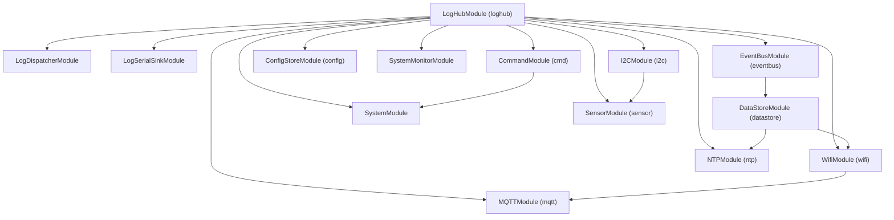

# Flow.io ESP32 Modular Framework

Framework C++17 pour ESP32 sous PlatformIO/Arduino + FreeRTOS. L’objectif est d’écrire le firmware comme une application : modules isolés, dépendances explicites, services typés, et usage mémoire prévisible (pas d’allocations dynamiques dans les chemins critiques du core).

## Points clés
- C++17 avec PlatformIO
- 1 task FreeRTOS par module actif
- Dépendances explicites et ordre d’init automatique
- Registre de services typés (`ServiceRegistry`)
- Configuration persistante via NVS (`ConfigStore` + `Preferences`)
- Import/Export JSON de config
- Bus d’événements (`EventBus`) avec payloads fixes
- Logging centralisé (hub + sinks)
- DataStore runtime + dirty flags + notifications
- Monitoring système (heap, stacks, uptime)

## Arborescence
```
src/
  main.cpp
  Core/
    Module.h / ModuleManager.h
    ServiceRegistry.h
    ConfigStore.h / ConfigTypes.h / ConfigMigrations.h
    EventBus/
    DataStore/
    LogHub.h / LogSinkRegistry.h
    SystemStats.h
    Services/ (interfaces de services)
  Modules/
    LogHubModule/
    LogDispatcherModule/
    LogSerialSinkModule/
    EventBusModule/
    ConfigStoreModule/
    DataStoreModule/
    CommandModule/
    SystemModule/
    SystemMonitorModule/
    WifiModule/
    NTPModule/
    MQTTModule/
    I2CModule/
    SensorModule/
platformio.ini
```

## Concepts

### Modules
Un module est une classe dérivée de `Module` (actif) ou `ModulePassive` (passif, sans task). Il doit fournir :
- `moduleId()` : id unique
- `dependencyCount()` / `dependency(i)` : dépendances explicites
- `init(...)` : init, wiring services, config
- `loop()` : boucle de task (modules actifs)

### Dépendances
Les dépendances sont déclarées dans chaque module et résolues par `ModuleManager`. Cela garantit l’ordre d’initialisation et évite les couplages implicites.

### Services
Les services sont des structs C typés avec pointeurs de fonctions. Les modules publient leurs services dans `ServiceRegistry` et les autres modules les récupèrent sans inclure directement leurs headers.

### Configuration
`ConfigStore` gère les variables de config, la persistance NVS, les migrations, et l’import/export JSON. Chaque variable est décrite via `ConfigVariable<T>`.

### Événements
`EventBus` fournit un bus d’événements thread-safe avec payloads fixes et dispatch centralisé.

### Logging
`LogHub` centralise les logs dans une queue. `LogDispatcherModule` lit la queue et pousse vers des sinks (Serial, etc.).

## Modules (actuels)
- **Logging**: `LogHubModule`, `LogDispatcherModule`, `LogSerialSinkModule`
- **System**: `SystemModule`, `SystemMonitorModule`
- **Network**: `WifiModule`, `NTPModule`, `MQTTModule`
- **Config/Data**: `ConfigStoreModule`, `DataStoreModule`
- **Messaging**: `EventBusModule`, `CommandModule`
- **I/O**: `I2CModule`, `SensorModule`

Note: `main.cpp` commente actuellement `I2CModule` et `SensorModule` (instabilité).

## Dépendances des modules

Module | Dépendances
---|---
`LogHubModule` | (aucune)
`LogDispatcherModule` | `loghub`
`LogSerialSinkModule` | `loghub`
`EventBusModule` | `loghub`
`CommandModule` | `loghub`
`ConfigStoreModule` | `loghub`
`DataStoreModule` | `eventbus`
`SystemModule` | `loghub`, `cmd`
`SystemMonitorModule` | `loghub`
`WifiModule` | `loghub`, `datastore`
`NTPModule` | `loghub`, `datastore`
`MQTTModule` | `loghub`, `wifi`
`I2CModule` | `loghub`
`SensorModule` | `loghub`, `i2c`

### Graphe de dépendance


## Exemples d’utilisation

### 1) Créer un module simple
```cpp
#pragma once
#include "Core/Module.h"
#include "Core/Services/Services.h"

class MyModule : public Module {
public:
    const char* moduleId() const override { return "my"; }
    const char* taskName() const override { return "my"; }

    uint8_t dependencyCount() const override { return 1; }
    const char* dependency(uint8_t i) const override {
        if (i == 0) return "loghub";
        return nullptr;
    }

    void init(ConfigStore& cfg, I2CManager& i2c, ServiceRegistry& services) override {
        logHub = services.get<LogHubService>("loghub");
    }

    void loop() override {
        if (logHub) {
            LOGHUBF(logHub, LogLevel::Info, "MY", "Hello from MyModule");
        }
        vTaskDelay(pdMS_TO_TICKS(1000));
    }

private:
    const LogHubService* logHub = nullptr;
};
```

### 2) Publier un service
```cpp
struct MyService {
    void (*doThing)(void* ctx, int v);
    void* ctx;
};

static void doThingImpl(void* ctx, int v) {
    // ...
}

void MyModule::init(ConfigStore&, I2CManager&, ServiceRegistry& services) {
    static MyService svc{ doThingImpl, this };
    services.add("myservice", &svc);
}
```

### 3) Consommer un service
```cpp
auto my = services.get<MyService>("myservice");
if (my && my->doThing) {
    my->doThing(my->ctx, 42);
}
```

### 4) Déclarer une config persistante
```cpp
struct MyConfig {
    int32_t threshold = 10;
};

MyConfig cfgData;

ConfigVariable<int32_t,0> thresholdVar {
    "my_thr", "threshold", "my", ConfigType::Int32,
    &cfgData.threshold, ConfigPersistence::Persistent, 0
};

void MyModule::init(ConfigStore& cfg, I2CManager&, ServiceRegistry&) {
    cfg.registerVar(thresholdVar);
}
```

### 5) Import/Export JSON
```cpp
char json[ConfigStore::JSON_BUFFER_SIZE];
registry.toJson(json, sizeof(json));
Serial.println(json);

registry.applyJson("{\"wifi\":{\"enabled\":false}}" );
```

### 6) Publier un événement
```cpp
EventBus* bus = services.get<EventBusService>("eventbus")?.bus;
if (bus) {
    SensorsUpdatedPayload p{ millis() };
    bus->post(EventId::SensorsUpdated, &p, sizeof(p));
}
```

## Spécifications MQTT

- [Spécification MQTT (v1.1 FR)](docs/mqtt_spec_v1_1.md)

## Guide du développeur

- [Guide du développeur](docs/dev_guide.md)

## Build & Flash
```
platformio run
platformio run -t upload
```

## Notes
- Aucun `std::vector`/`std::function` dans le core.
- Buffers statiques et tailles de stack fixées.
- Monitoring périodique via `SystemMonitorModule`.

## Licence
Non définie. Ajoutez un fichier de licence si vous souhaitez distribuer.
