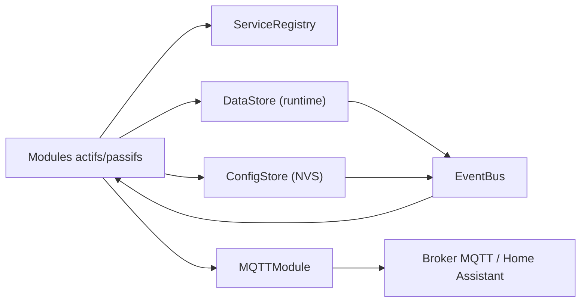

# Architecture Core

## Principes

Flow.IO suit une architecture modulaire orientée contrats:
- chaque module déclare ses dépendances (`dependencyCount`, `dependency`)
- les interactions inter-modules passent par des services typés (`ServiceRegistry`)
- les changements d'état runtime passent par `DataStore` + notifications `EventBus`
- la configuration persistante passe par `ConfigStore` (NVS) + événements `ConfigChanged`

## Composants clés

- `ModuleManager`: tri topologique des dépendances, init, `onConfigLoaded`, start des tasks
- `ServiceRegistry`: registre de services par identifiant string (`add/get<T>()`)
- `EventBus`: queue thread-safe, dispatch par callbacks
- `DataStore`: état runtime centralisé + `DataChanged` / `DataSnapshotAvailable`
- `ConfigStore`: variables de config déclarées, chargement/sauvegarde NVS, JSON import/export

## Chaîne de logs

Pipeline logs:
- `LogHubModule`: buffer central des entrées log
- `LogDispatcherModule`: redistribue vers les sinks enregistrés
- `LogSerialSinkModule`: sortie `Serial`
- `LogAlarmSinkModule` (`log.sink.alarm`): convertit les logs `Warn/Error` en conditions d'alarme (`AlarmModule`)

## Flux principal

## Séquence de boot

1. `Preferences.begin("flowio")`
2. injection `Preferences` dans `ConfigStore`
3. migrations de schéma (`runMigrations`)
4. enregistrement modules dans `ModuleManager`
5. `initAll()`
- init modules en ordre topologique
- `loadPersistent()`
- `onConfigLoaded()`
- démarrage des modules actifs
6. câblage runtime MQTT (routes snapshots runtime)
7. boot orchestrator (release différée MQTT/HA)

## Runtime publisher multiplexé

Dans `main.cpp`, un multiplexeur runtime:
- enregistre les providers `IRuntimeSnapshotProvider` (`io`, `pooldev`, `poollogic`)
- construit des routes `rt/io/...`, `rt/pdm/state/...`, `rt/pdm/metrics/...`
- publie seulement les routes changées selon timestamp + dirty mask
- publie des snapshots système supplémentaires:
  - `rt/runtime/state`
  - `rt/network/state`
  - `rt/system/state`

## Règles d'intégration recommandées

- Un module ne dépend jamais d'une implémentation concrète d'un autre module, uniquement d'un service.
- Les écritures runtime partagées passent par `DataStore` helpers (`*Runtime.h`) pour notifier proprement.
- Les changements de config doivent utiliser `ConfigStore::set()` pour persistance + `ConfigChanged`.
- Les callbacks EventBus doivent rester courts et non bloquants.
